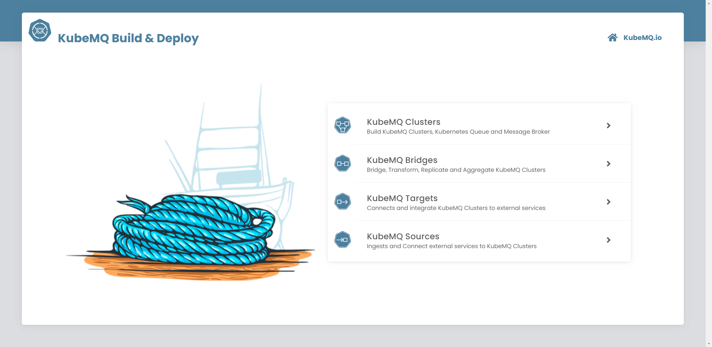
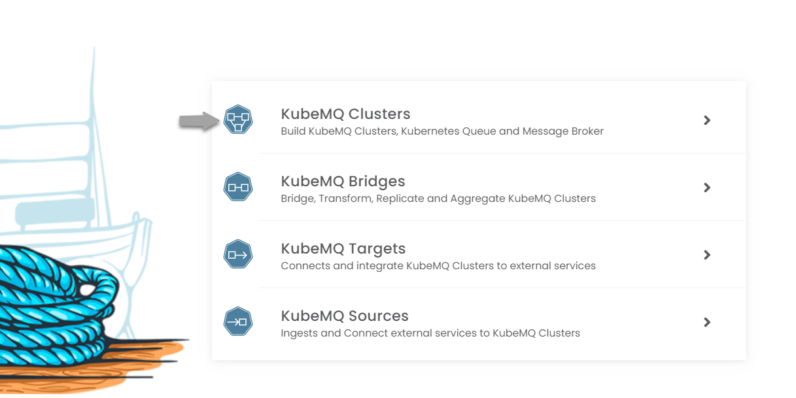
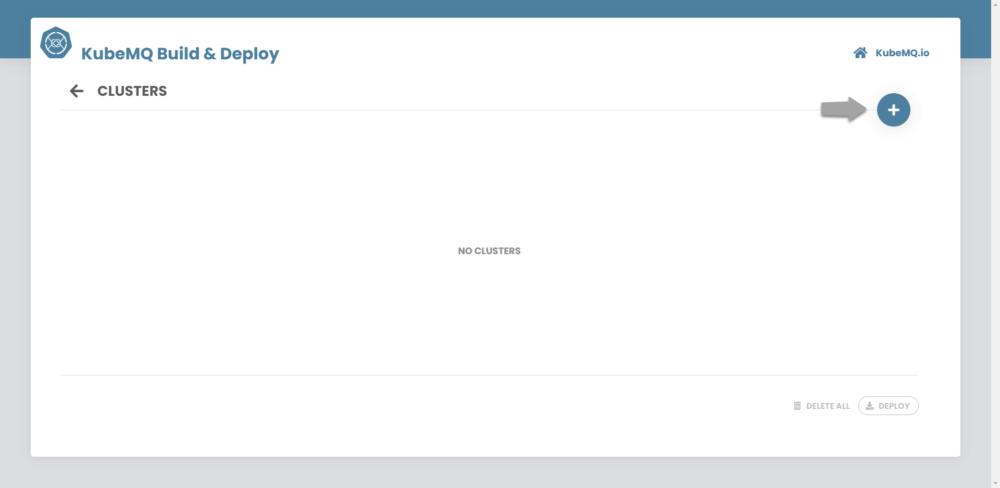
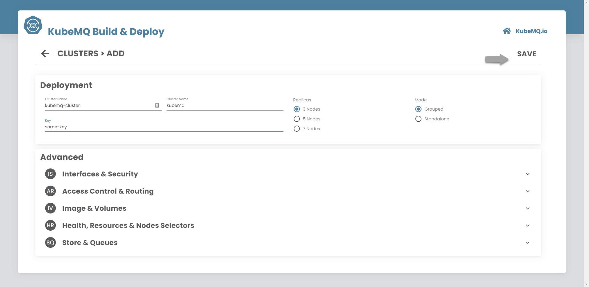
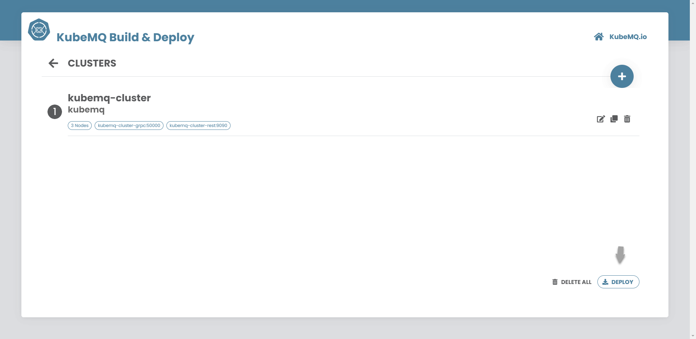
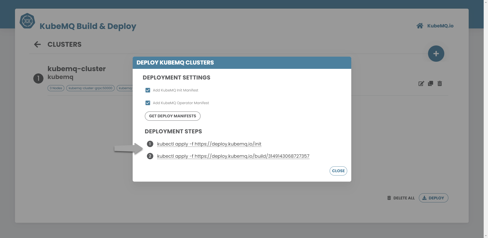

# Build & Deploy

## Build & Deploy KubeMQ Components

Build & Deploy is an online tool that allows building KubeMQ components configurations with few clicks and deploy these configurations with the kubectl command line.

## Basic Flow

Build & Deploy basic flow is:

### Pick KubeMQ Component

### Add Configuration

### Configure

### Finish Configuration

### Get Deploy Links

