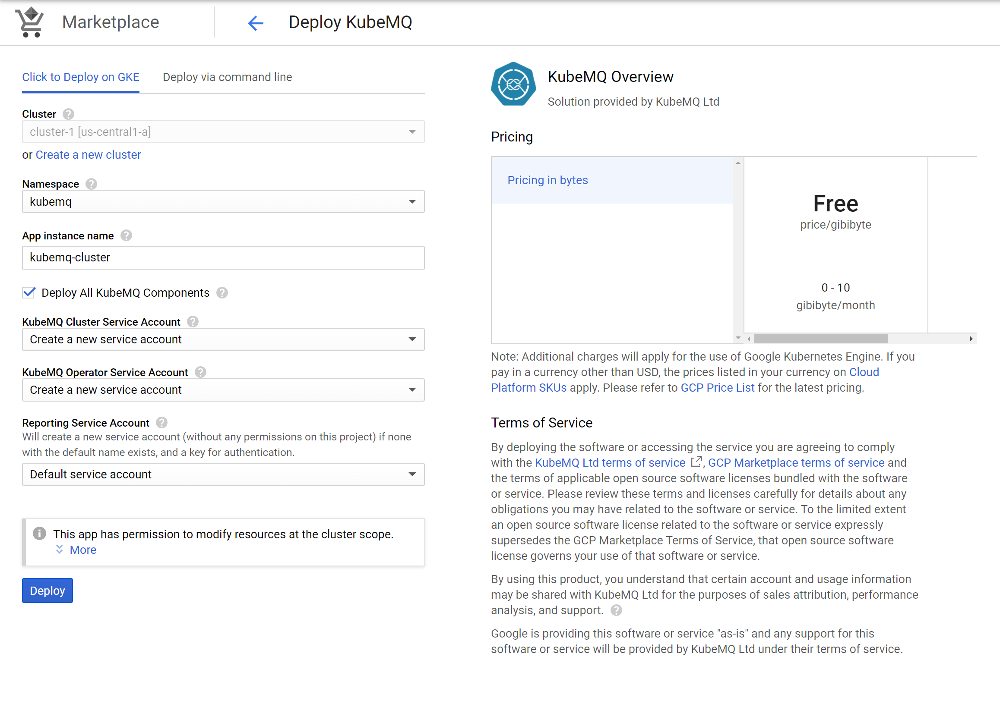

# Google Cloud Platform

KubeMQ cluster can be deployed via Google Cloud Platform (GCP) marketplace

## Install KubeMQ Cluster 

1. Search KubeMQ solution in GCP marketplace
2. Click Configure
3. Fill deployment parameters

4. Click Deploy

## Configuration

Check out cluster configuration setting available:



