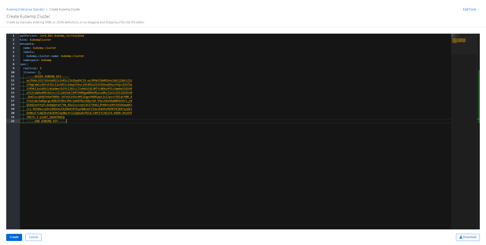
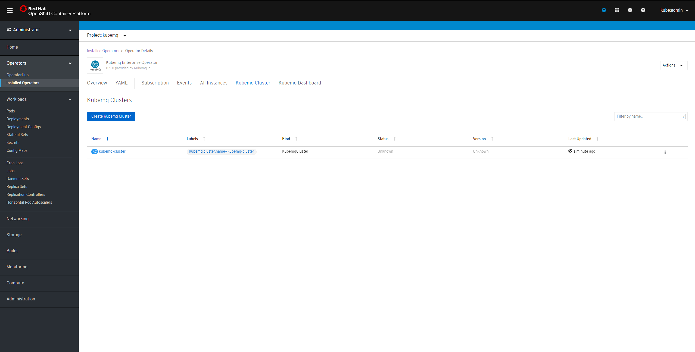

# Openshift

## Install KubeMQ operator

### Find KubeMQ Operator

1. Open Operators/OperatorHub
2. Goto Streaming & Messaging
3. Type KubeMQ in search box
4. Click on KubeMQ Enterprise Operator


### Install KubeMQ Operator

1. Set Installation mode to A specific namespace on the cluster
2. Set the namespace
3. Click Subscribe


## Verify Operator Installation


## Install KubeMQ Cluster Enterprise Edition

1. Click On KubeMQ Cluster
2. Click on Create New
3. A yaml editor will open with default configuration will open


For all installations of Kubemq in Openshift platform, a License key is required.

Obtain free license key: [Register](https://account.kubemq.io/login/register)


4. Get the license key from the welcome email

5. Insert the license key into the spec section

Example:

```yaml
apiVersion: core.k8s.kubemq.io/v1alpha1
kind: KubemqCluster
metadata:
  name: kubemq-cluster
  namespace: kubemq
spec:
  license: |-
    eyJhbGciOiJSUzUxMiIsInR5cCI6IkpXVCJ9.eyJMYWJlbHMiOnsibGljZW5zZS1
    tYXgtaW5zdGFuY2VzIjofsdfsdfsdfSIsImxpY2Vuc2UtdHlwZSI6IkVudGVycHJ
    iYXVkIjoidGhlLWtpdfsstb2YtZ28iLCJleHAiOjE2MTYzNDAzMTEsImp0aSI6In
    oZS1taWdodHktbffflvciIsImlhdCI6MTU4NDgwNDMxMSwiaXNzIjoiS3ViZU1RI
    .BwGlucqbGBsdf3hAaFNXhU-1H7eOLXtkvAM5jSgesMdN5pptjsIIpsvY2DiaF40
    tYa1vQoJwsdBQacgLADBZRrBbnJPKvimAXYNuZ6Nyv9d-V9ez6XoVDq0WhG56r5_
    QikQ5entYqfLdxHqQetwt7Ym_0IwlxzcnqtCKCETkUGijP48UtuOPV3XSUUawXR3
    cLi-NZh0avzp9niXGDxVuCNjRm4iRT6uyUWkxoF25UulkmYHzM69DTBjkN7q2pk1
    6VNKaT7LWQ3knt0ZkPRlhp0WzYrluZQUuXnfRZdL7dPCFtC4E2T6-04bM-OVufUf
    JM272-J-y5eB7_hGnH7bNZQeqweqweqweqe23424wqed
```

6. Click create



## Verify KubeMQ Cluster Installation



## Configuration

Check out cluster configuration setting available:



