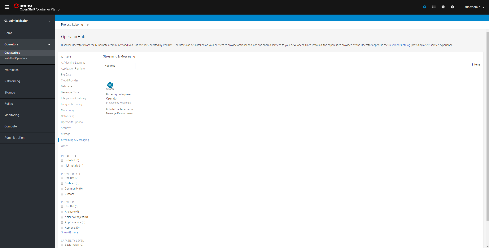
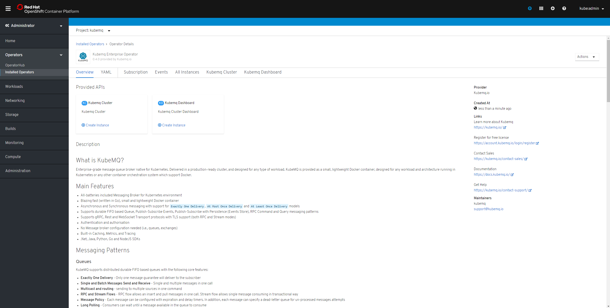

# Openshift

## Install KubeMQ operator

### Find KubeMQ Operator

1. Open Operators/OperatorHub
2. Goto Streaming & Messaging
3. Type KubeMQ in search box
4. Click on KubeMQ Enterprise Operator

### Install KubeMQ Operator

1. Set Installation mode to A specific namespace on the cluster
2. Set the namespace
3. Click Subscribe

## Verify Operator Installation

## Install KubeMQ Cluster Enterprise Edition

1. Click On KubeMQ Cluster
2. Click on Create New
3. A yaml editor will open with default configuration will open
4. Click Create


For all installations of Kubemq in Openshift platform, a License key is required.

Obtain free license key: [Register](https://account.kubemq.io/login/register)


## Verify KubeMQ Cluster Installation

## Configuration

Check out cluster configuration setting available:



