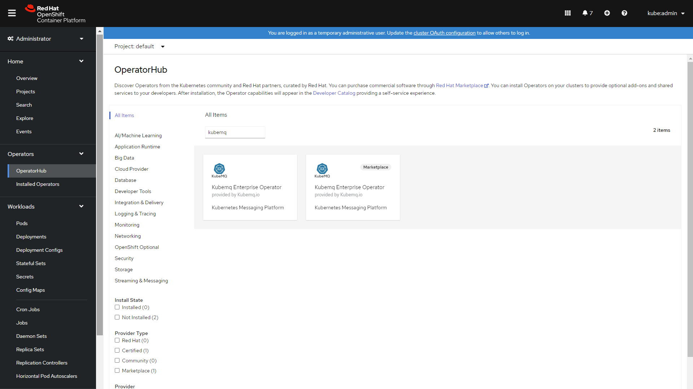
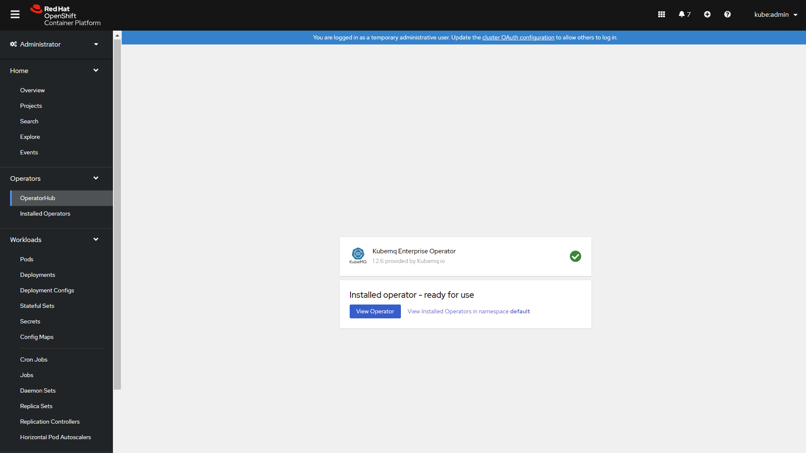
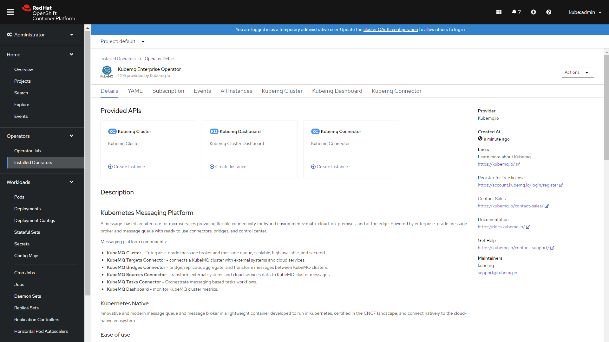

# Openshift

## Install KubeMQ operator

### Find KubeMQ Operator

1. Open Operators/OperatorHub
2. Goto Streaming & Messaging
3. Type KubeMQ in search box
4. Click on Kubemq Enterprise Operator



### Install KubeMQ Operator

1. Set Installation mode to A specific namespace on the cluster
2. Set the namespace
3. Click Subscribe


### Verify Operator Installation





### Install KubeMQ Connector

1. Click On Kubemq Connector&#x20;
2. Click on Create KubemqConnector
3. Click on Configure via YAML View
4. A yaml editor will open with default configuration will open
5. Select one of the configurations below

#### Create Targets Connector

```yaml
apiVersion: core.k8s.kubemq.io/v1alpha1
kind: KubemqConnector
metadata:
  name: kubemq-targets
spec:
  type: targets
  config: |-
    bindings: null
```

#### Create Sources Connector

```yaml
apiVersion: core.k8s.kubemq.io/v1alpha1
kind: KubemqConnector
metadata:
  name: kubemq-sources
spec:
  type: sources
  config: |-
    bindings: null
```

#### Create Bridges Connector

```yaml
apiVersion: core.k8s.kubemq.io/v1alpha1
kind: KubemqConnector
metadata:
  name: kubemq-bridges
spec:
  type: bridges
  config: |-
    bindings: null
```

6\. Click Create


