# Openshift

## Install KubeMQ operator

### Find KubeMQ Operator

1. Open Operators/OperatorHub
2. Goto Streaming & Messaging
3. Type KubeMQ in search box
4. Click on Kubemq Enterprise Operator

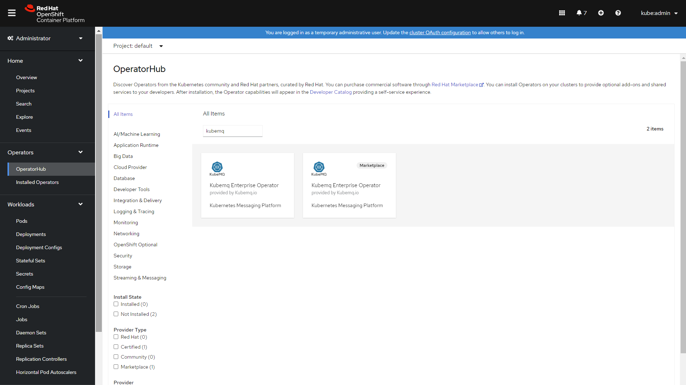

### Install KubeMQ Operator

1. Set Installation mode to A specific namespace on the cluster
2. Set the namespace
3. Click Subscribe

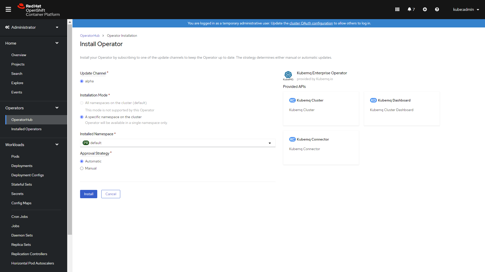

### Verify Operator Installation

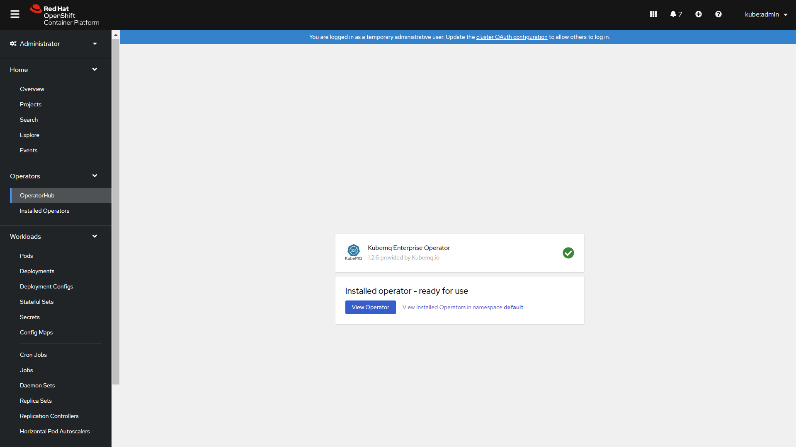

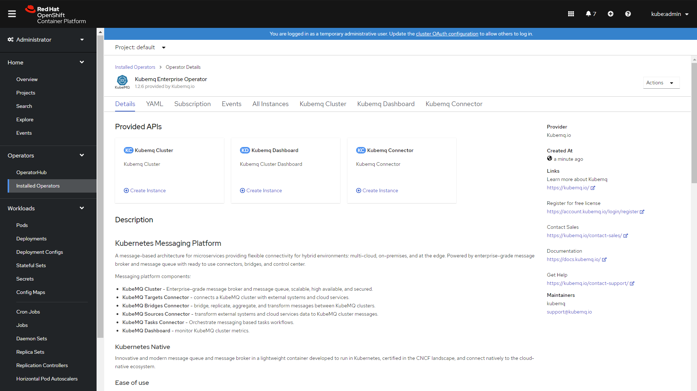

## Install KubeMQ Dashboard

1. Click On Kubemq Dashboard 
2. Click on Create KubeMQDashboard
3. Click on Configure via YAML View
4. A yaml editor will open with default configuration will open
5. Click Create

Example:

```yaml
apiVersion: core.k8s.kubemq.io/v1alpha1
kind: KubemqDashboard
metadata:
  name: kubemq-dashboard
  namespace: default
```

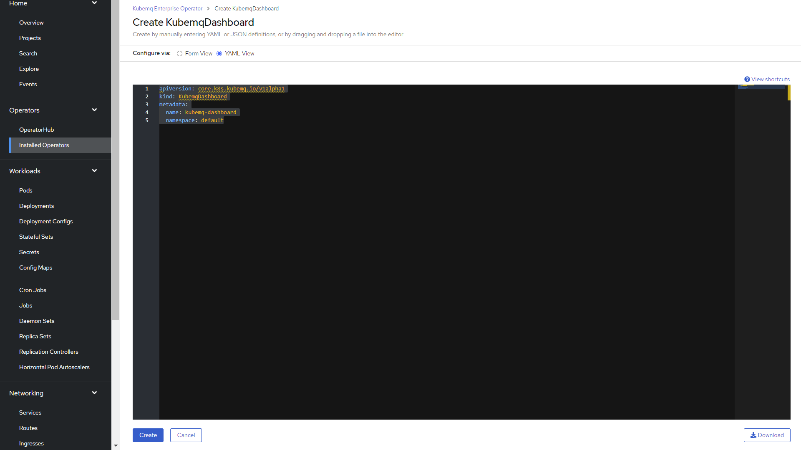

### Verify KubeMQ Dashboard Installation

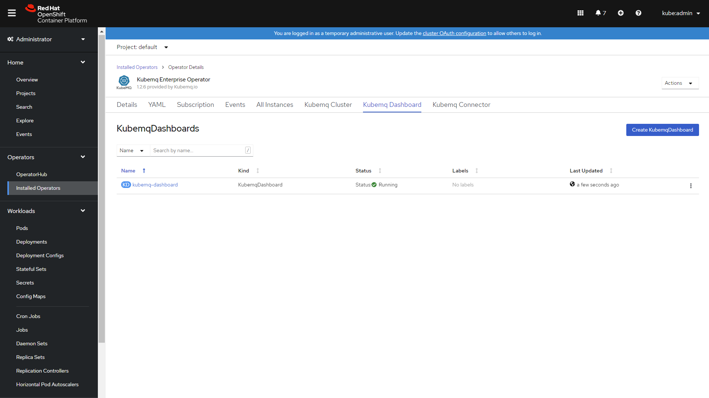

## View Grafana Dashboard

### Add Route

1. Click on Networking and then on Routes
2. Click on Create Route

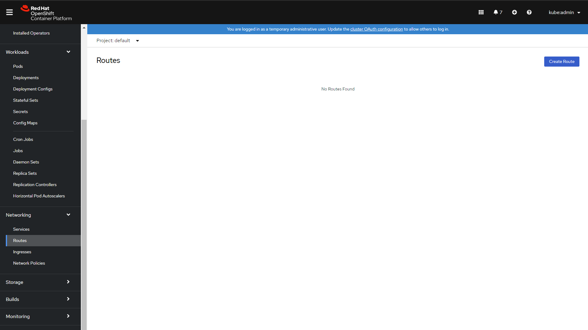

3.  Set Route name

4. Select Kubemq-dashboard Service

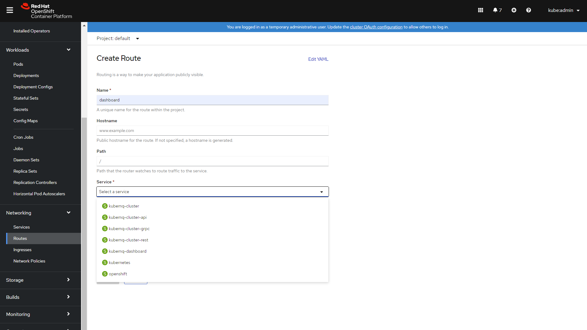

5. Set Target Port to 3000-&gt;3000\(TCP\)

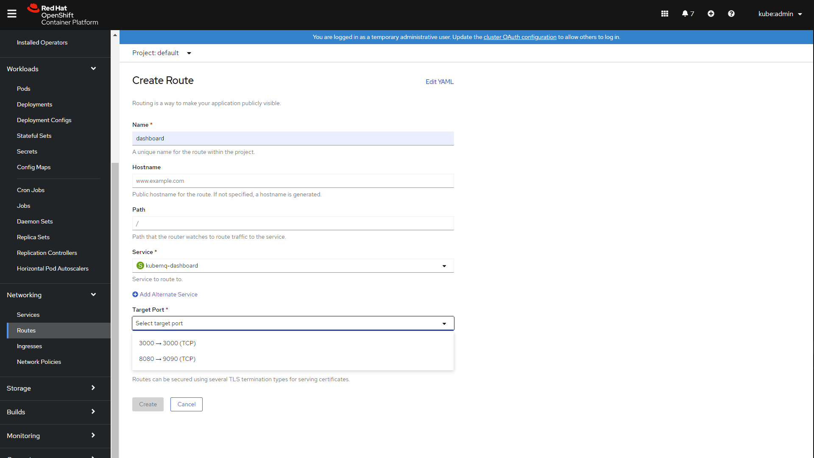

6. Click Create

### Configure Grafana Dashboard

1. Open the route link

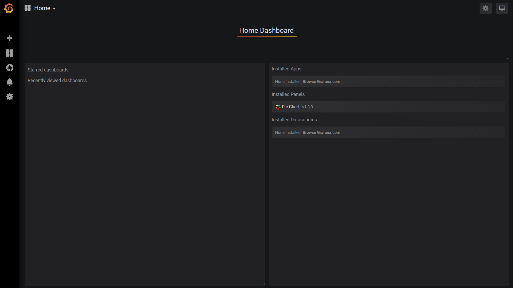

2. Click on the Home drop-down box

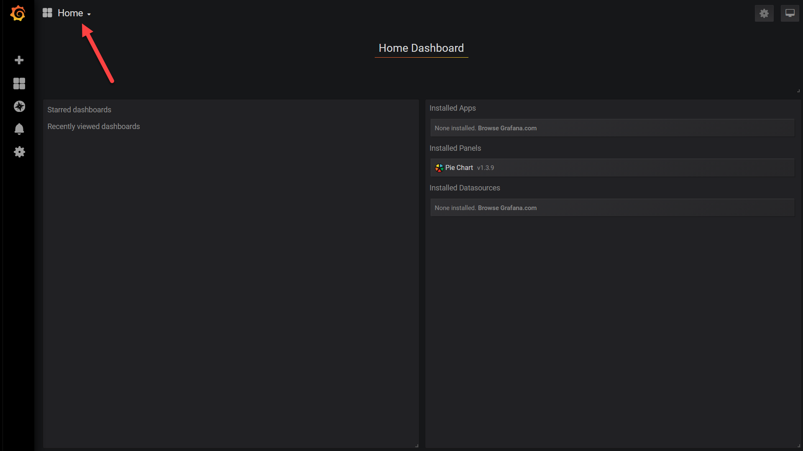

3. Select Kubemq Dashboard

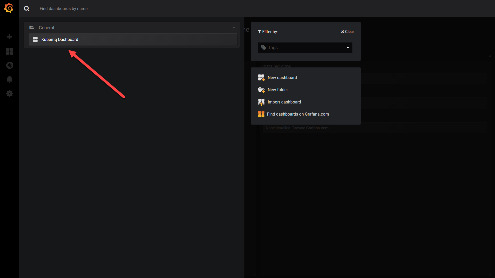

4. Kubemq Dashboard will appear

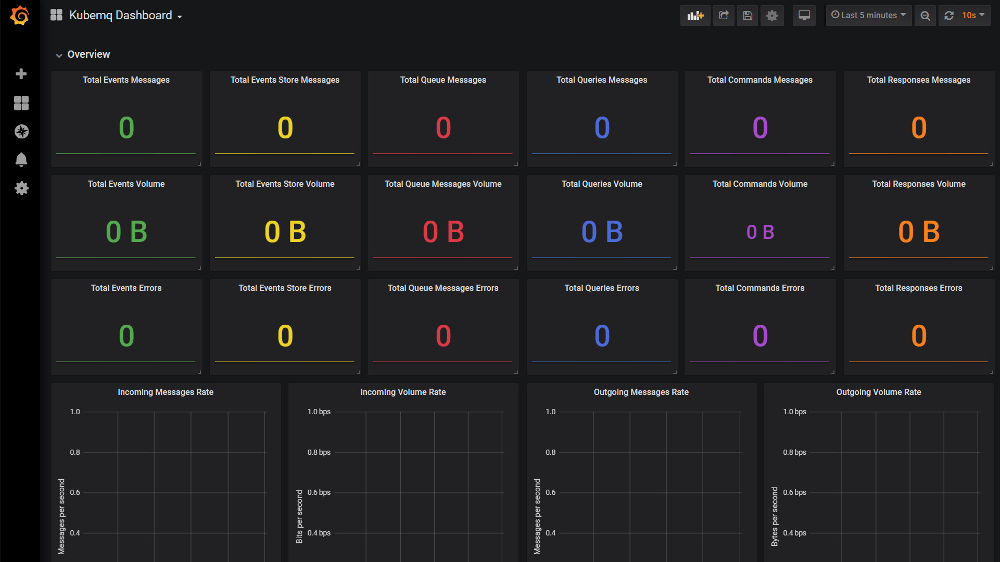

## Configuration

Check out dashboard configuration setting available:



