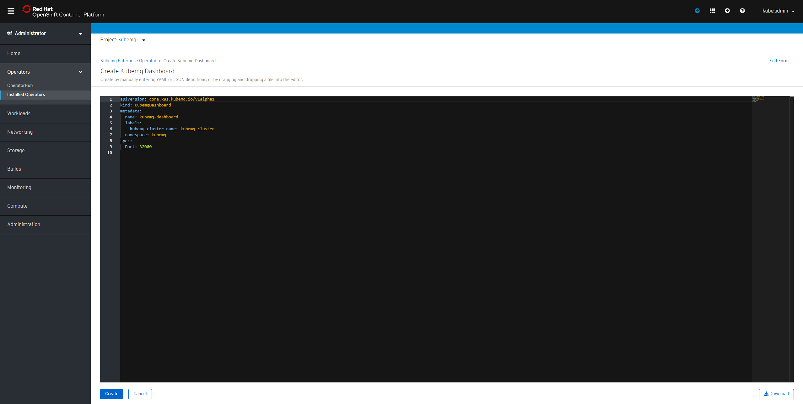

# Openshift

## Install KubeMQ operator

### Find KubeMQ Operator

1. Open Operators/OperatorHub
2. Goto Streaming & Messaging
3. Type KubeMQ in search box
4. Click on Kubemq Enterprise Operator

### Install KubeMQ Operator

1. Set Installation mode to A specific namespace on the cluster
2. Set the namespace
3. Click Subscribe

### Verify Operator Installation

### Install KubeMQ Dashboard

1. Click On Kubemq Dashboard 
2. Click on Create New
3. A yaml editor will open with default configuration will open
4. Click Create

### Verify KubeMQ Dashboard Installation

## Configuration

Check out  dashboard configuration setting available:



