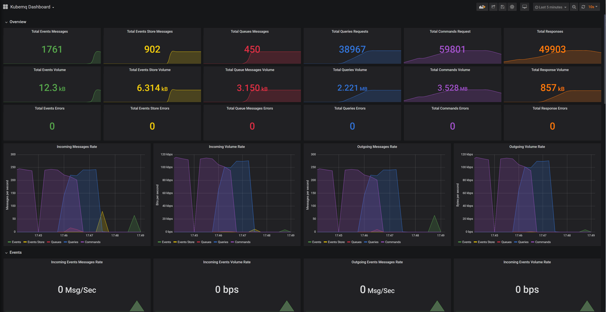
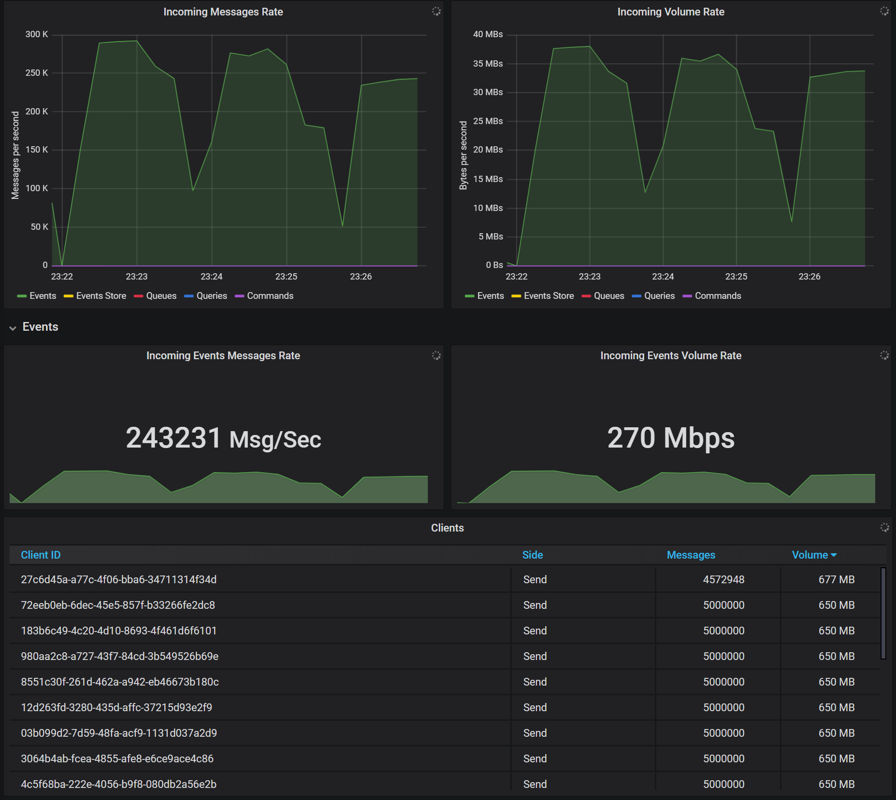

# Dashboard

## Kubemq Dashboard Main View

## Exported Metrics

Kubemq exports the following metrics:

| Metric | Tytp | Labels |
| :--- | :--- | :--- |
| Messages Count | Counter | "node", "client\_id", "type", "side", "channel" |
| Messages Volume | Counter | "node", "client\_id", "type", "side", "channel" |
| Messages Errors | Counter | "node", "client\_id", "type", "side", "channel" |
| Clients | Gauge | "node", "client\_id", "type", "side", "channel" |

Labels descriptions:

| Label | Description / Values |
| :--- | :--- |
| node | node in the cluster name, i.e. kubemq-cluster-0 |
| client\_id | client id name |
| type | "events", "events\_store","queue","commands","queries","responses" |
| side | "send", "receive" |
| channel | channel name |

## Kubemq Dashboard Panels

### Overview

| View | Resource |
| :--- | :--- |
| Total Messages | Events, Events Store, Queues, Queries, Commands, Responses |
| Total Volume | Events, Events Store, Queues, Queries, Commands, Responses |
| Total Errors | Events, Events Store, Queues, Queries, Commands, Responses |
| Incoming Message Rate | Events, Events Store, Queues, Queries, Commands |
| Incoming Volume Rate | Events, Events Store, Queues, Queries, Commands |
| Outgoing Message Rate | Events, Events Store, Queues, Queries, Commands |
| Outgoing Volume Rate | Events, Events Store, Queues, Queries, Commands |

