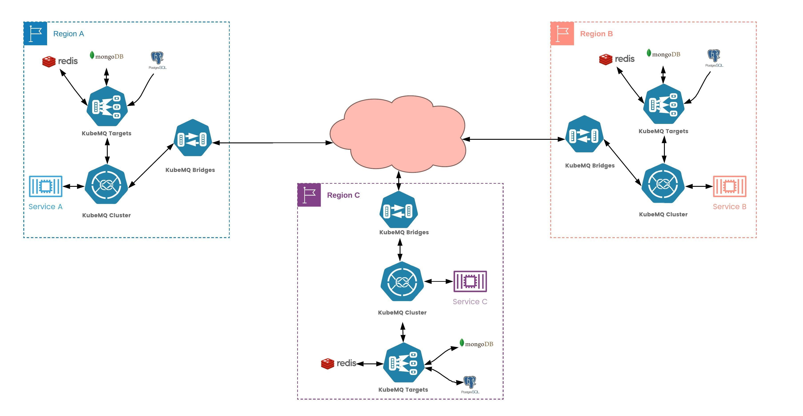
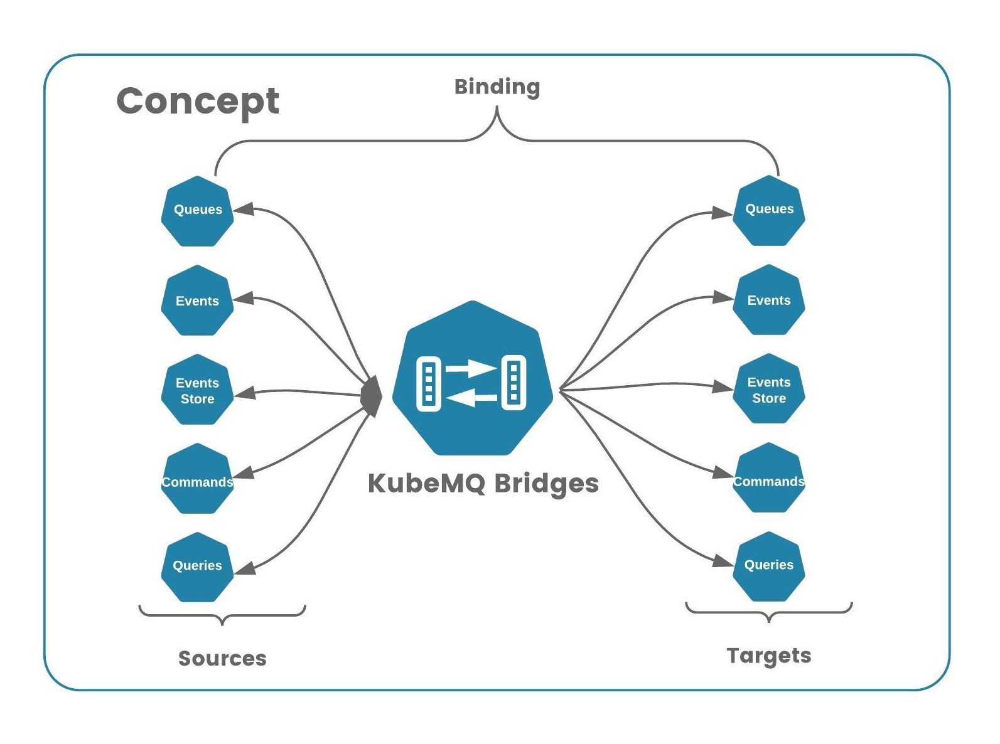
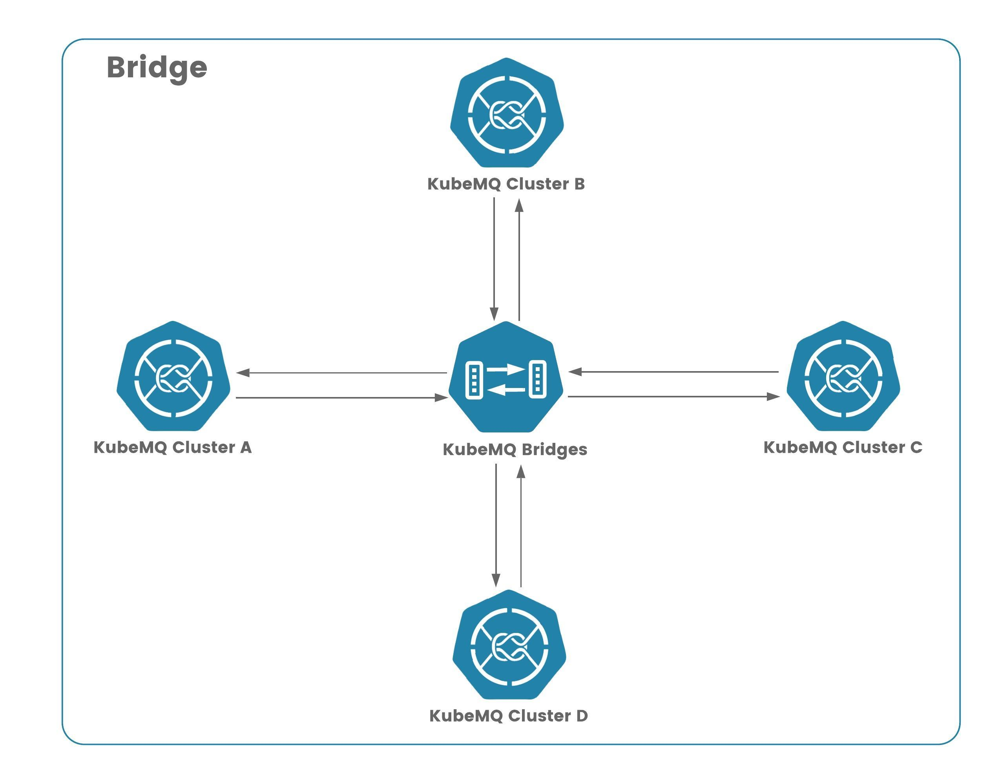
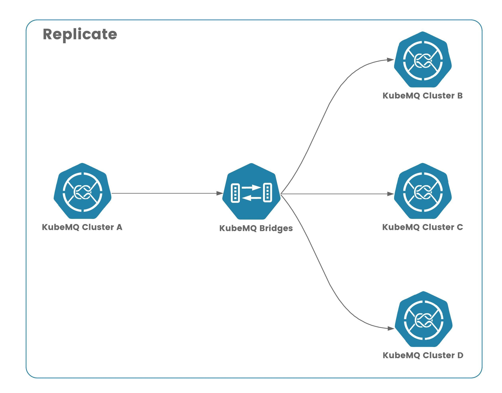
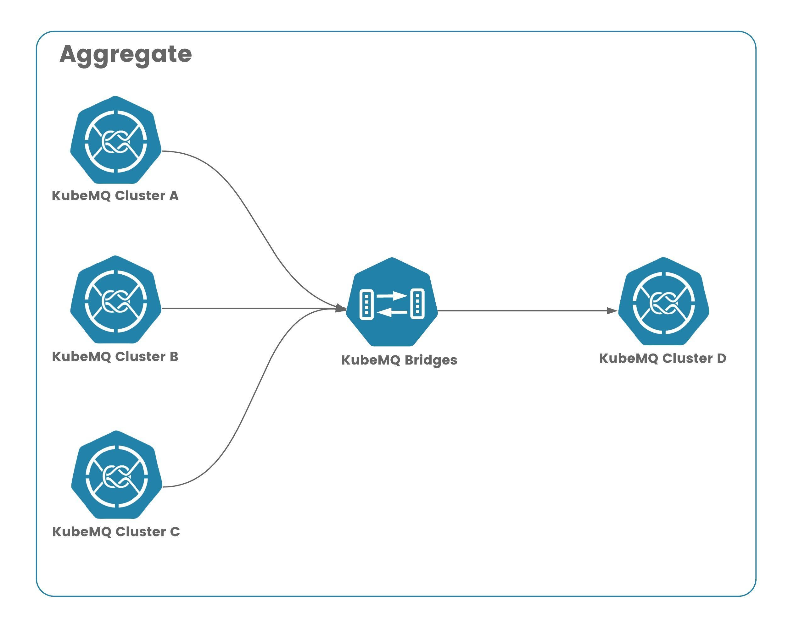
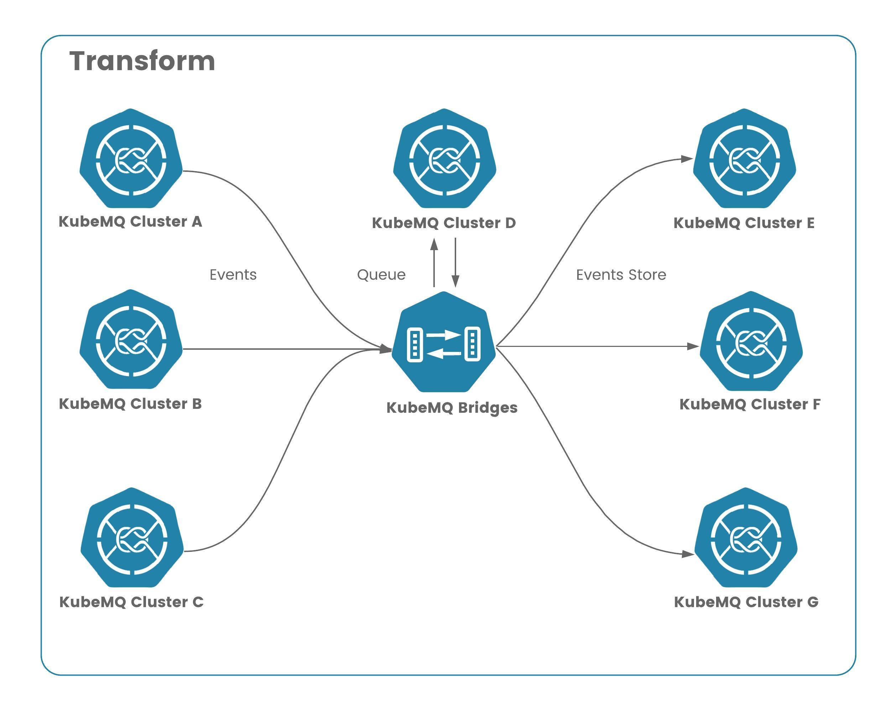

# KubeMQ Bridges

KubeMQ Bridges bridge, replicate, aggregate, and transform messages between KubeMQ clusters no matter where they are, allowing to build a true cloud-native messaging single network running globally.

**Key Features**:

* **Runs anywhere**  - Kubernetes, Cloud, on-prem , anywhere
* **Stand-alone** - small docker container / binary
* **Build Any Topology** - connects KubeMQ clusters in 1:1, 1:n , n:1, n:n
* **Middleware Supports** - Logs, Metrics, Retries and Rate Limiters
* **Easy Configuration** - simple yaml file builds your topology

**An example of a use case:**



## Concept

KubeMQ Bridges' concept is bridging between sources and targets, thus Bindings.

Binding can be any source kinds to any target kinds, as shown below:



KubeMQ Bridges can support any binding topology :

| Topology | Description | Sources-Targets |
| :--- | :--- | :--- |
| Bridge | a 1:1 connectivity mainly for sync type of messages | one source to 1 target |
| Replicate | a 1:n connectivity allowing  replicating messages between clusters | one source to n targets |
| Aggregate | an n:1 connectivity allowing aggregating streams fo messages from clusters to a single target | n source to 1 target |
| Transform | an n:n mix and match sources and targets in many to many topology | n sources to n targets |

### Bridge



### Replicate



### Aggregate



### Transform



## Middlewares

In bindings configuration, KubeMQ Bridges supports middleware setting for each pair of source and target bindings.

These properties contain middleware information settings as follows:

### Logs Middleware

KubeMQ Bridges supports level based logging to console according to as follows:

| Property | Description | Possible Values |
| :--- | :--- | :--- |
| log\_level | log level setting | "debug","info","error" |
|  |  | "" - indicate no logging on this bindings |

An example for only error level log to console:

```yaml
bindings:
  - name: sample-binding 
    properties: 
      log_level: error
    sources:
    ......
```

### Retry Middleware

KubeMQ Bridges supports Retries' target execution before reporting of error back to the source on failed execution.

Retry middleware settings values:

| Property | Description | Possible Values |
| :--- | :--- | :--- |
| retry\_attempts | how many retries before giving up on target execution | default - 1, or any int number |
| retry\_delay\_milliseconds | how long to wait between retries in milliseconds | default - 100ms or any int number |
| retry\_max\_jitter\_milliseconds | max delay jitter between retries | default - 100ms or any int number |
| retry\_delay\_type | type of retry delay | "back-off" - delay increase on each attempt |
|  |  | "fixed" - fixed time delay |
|  |  | "random" - random time delay |

An example for 3 retries with back-off strategy:

```yaml
bindings:
  - name: sample-binding 
    properties: 
      retry_attempts: 3
      retry_delay_milliseconds: 1000
      retry_max_jitter_milliseconds: 100
      retry_delay_type: "back-off"
    sources:
    ......
```

### Rate Limiter Middleware

KubeMQ Sources support a Rate Limiting of target executions.

Rate Limiter middleware settings values:

| Property | Description | Possible Values |
| :--- | :--- | :--- |
| rate\_per\_second | how many executions per second will be allowed | 0 - no limitation |
|  |  | 1 - n integer times per second |

An example for 100 executions per second:

```yaml
bindings:
  - name: sample-binding 
    properties: 
      rate_per_second: 100
    source:
    ......
```

