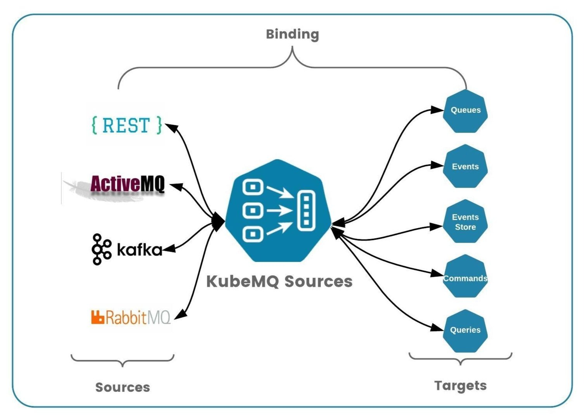

# KubeMQ Sources

KubeMQ Sources connects external systems and cloud services with KubeMQ message queue broker.

KubeMQ Sources allows us to build a message-based microservices architecture on Kubernetes with minimal efforts and without developing connectivity interfaces between external system such as messaging components \(RabbitMQ, Kafka, MQTT\) ,REST APIs and KubeMQ message queue broker. In addition, KubeMQ Sources allows migrating legacy systems \(together with [KubeMQ Targets](https://github.com/kubemq-hub/kubemq-targets)\) to KubeMQ based messaging architecture.

**Key Features**:

* **Runs anywhere**  - Kubernetes, Cloud, on-prem, anywhere
* **Stand-alone** - small docker container / binary
* **Single Interface** - One interface all the services
* **API Gateway** - Act as an REST Api gateway
* **Plug-in Architecture** Easy to extend, easy to connect
* **Middleware Supports** - Logs, Metrics, Retries, and Rate Limiters
* **Easy Configuration** - simple yaml file builds your topology

## Concepts

KubeMQ Sources building blocks are:

* Binding
* Source
* Target

### Binding

Binding is a 1:1 connection between Source and Target. Every Binding runs independently.



### Source

Source is an external service that provide ingress data to KubeMQ's channels which then later consumed by services connected to KubeMQ server.

Source can be services such HTTP REST Api, Messaging systems \(RabbitMQ, Kafka, MQTT etc\).

KubeMQ Sources integrate each one of the supported sources and ingest data into KubeMQ via Targets.

### Target

The target is a KubeMQ connection which send the data from the sources and route them to the appropriate KubeMQ channel for action, and return back a response if needed.

## Middlewares

In bindings configuration, KubeMQ Bridges supports middleware setting for each pair of source and target bindings.

These properties contain middleware information settings as follows:

### Logs Middleware

KubeMQ Bridges supports level based logging to console according to as follows:

| Property | Description | Possible Values |
| :--- | :--- | :--- |
| log\_level | log level setting | "debug","info","error" |
|  |  | "" - indicate no logging on this bindings |

An example for only error level log to console:

```yaml
bindings:
  - name: sample-binding 
    properties: 
      log_level: error
    sources:
    ......
```

### Retry Middleware

KubeMQ Bridges supports Retries' target execution before reporting of error back to the source on failed execution.

Retry middleware settings values:

| Property | Description | Possible Values |
| :--- | :--- | :--- |
| retry\_attempts | how many retries before giving up on target execution | default - 1, or any int number |
| retry\_delay\_milliseconds | how long to wait between retries in milliseconds | default - 100ms or any int number |
| retry\_max\_jitter\_milliseconds | max delay jitter between retries | default - 100ms or any int number |
| retry\_delay\_type | type of retry delay | "back-off" - delay increase on each attempt |
|  |  | "fixed" - fixed time delay |
|  |  | "random" - random time delay |

An example for 3 retries with back-off strategy:

```yaml
bindings:
  - name: sample-binding 
    properties: 
      retry_attempts: 3
      retry_delay_milliseconds: 1000
      retry_max_jitter_milliseconds: 100
      retry_delay_type: "back-off"
    sources:
    ......
```

### Rate Limiter Middleware

KubeMQ Sources support a Rate Limiting of target executions.

Rate Limiter middleware settings values:

| Property | Description | Possible Values |
| :--- | :--- | :--- |
| rate\_per\_second | how many executions per second will be allowed | 0 - no limitation |
|  |  | 1 - n integer times per second |

An example for 100 executions per second:

```yaml
bindings:
  - name: sample-binding 
    properties: 
      rate_per_second: 100
    source:
    ......
```

