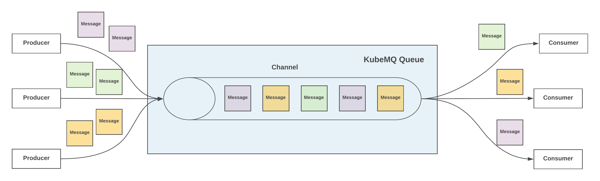
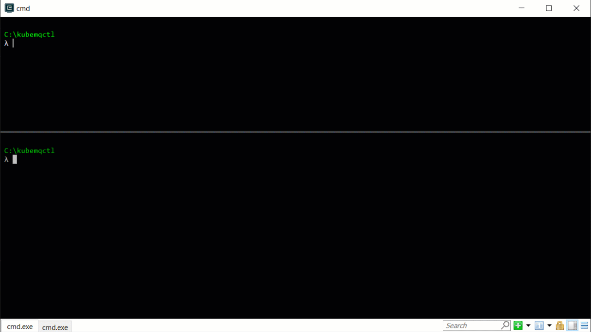
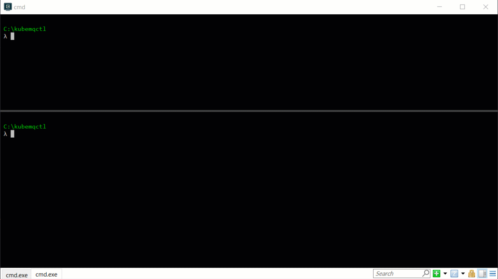
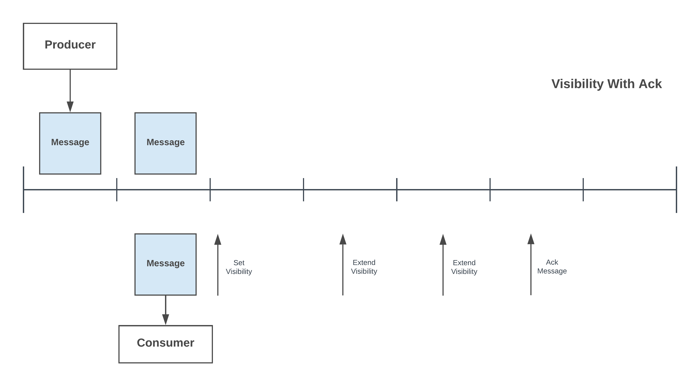
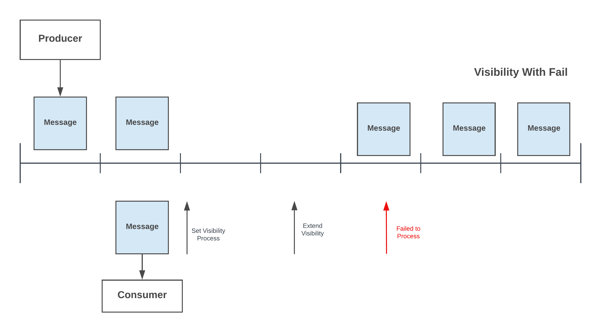
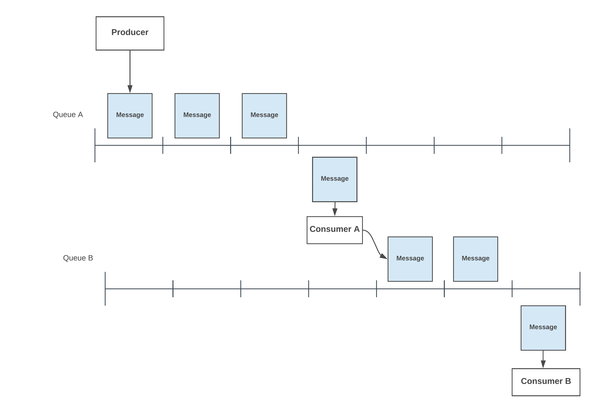
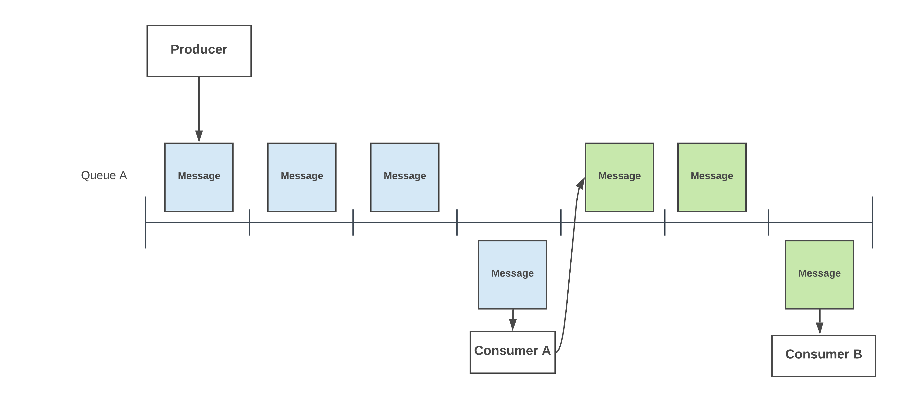
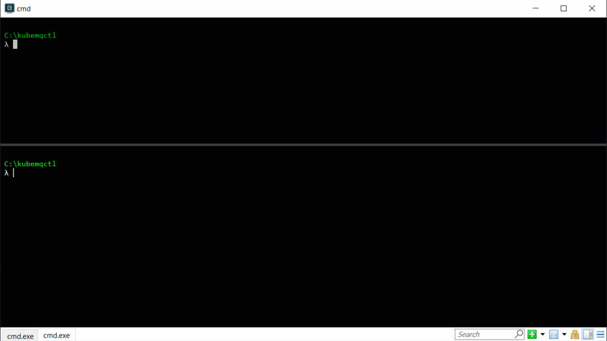
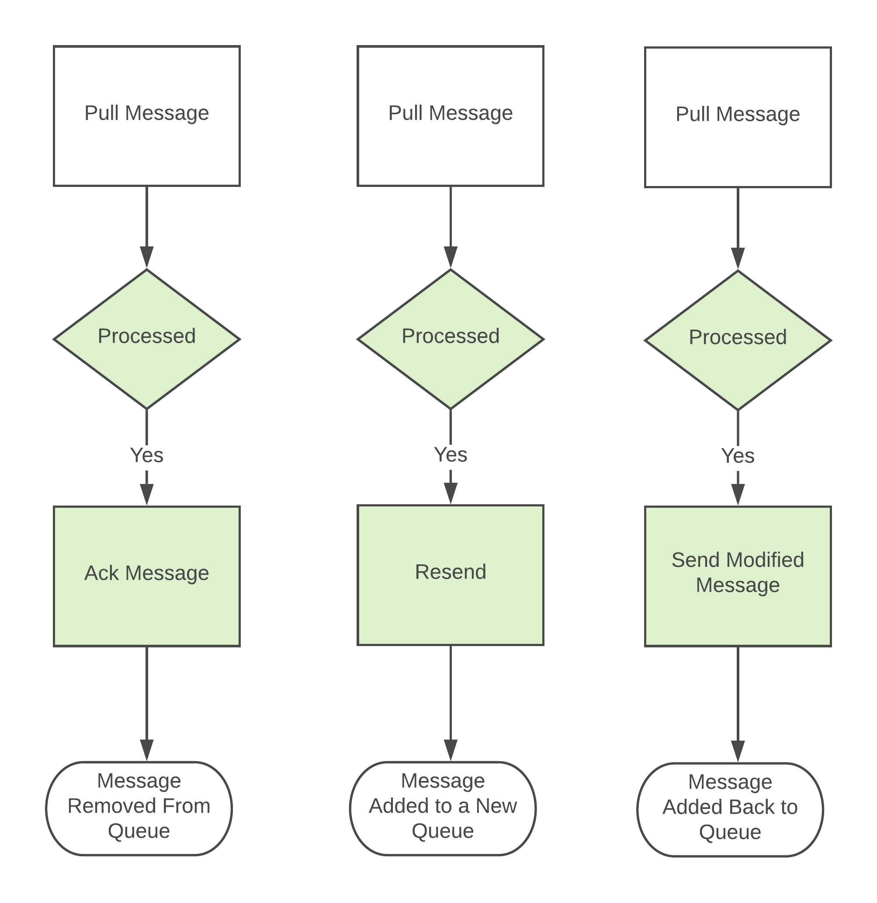
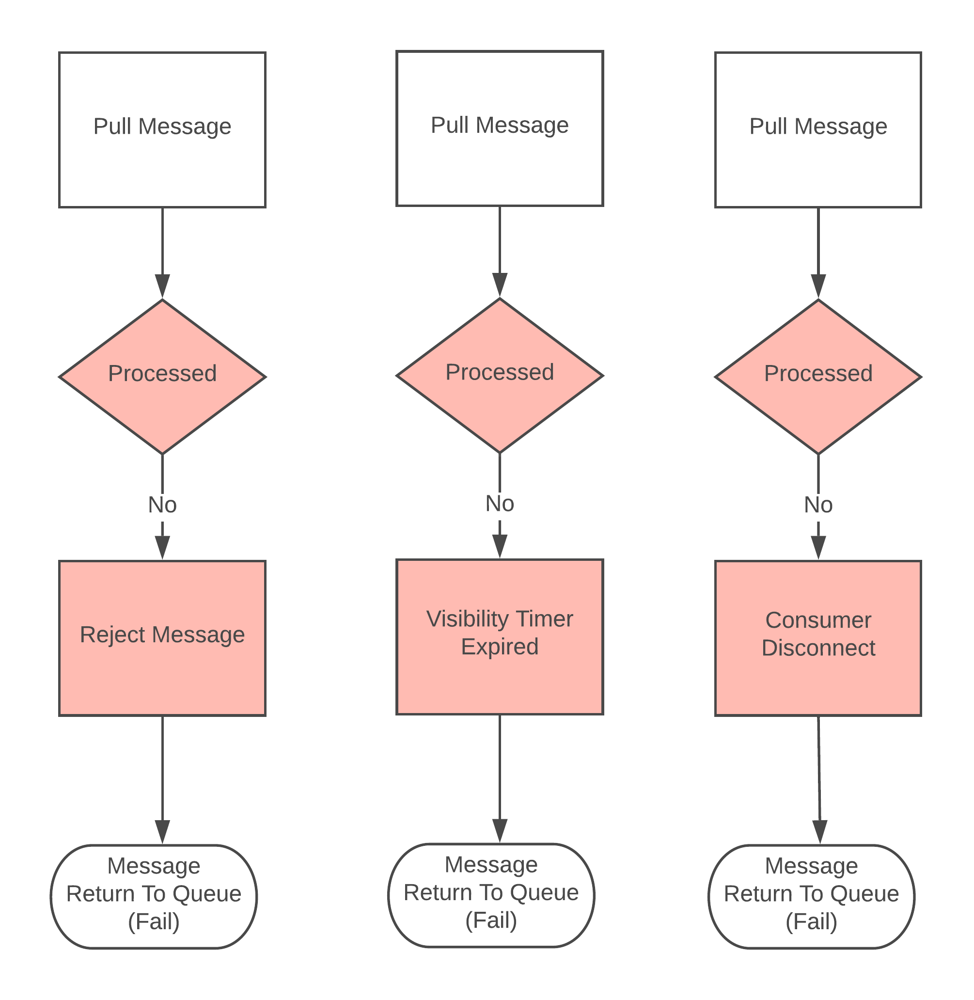

# Queues
Message queues provide an asynchronous communications protocol, meaning that the sender and receiver of the message do not need to interact with the message queue at the same time. Messages placed onto the queue are stored until the recipient retrieves them.

Message queues have implicit or explicit limits on the size of data that may be transmitted in a single message and the number of messages that may remain outstanding in the queue.

## Core Features
KubeMQ supports distributed durable FIFO based queues with the following core features:

- **Exactly One Delivery** - Only one message guarantee will deliver to the subscriber
- **Single and Batch Messages Send and Receive** - Single and multiple messages in one call
- **RPC and Stream Flows** - RPC flow allows an insert and pulls messages in one call. Stream flow allows single message consuming in a transactional way
- **Message Policy** - Each message can be configured with expiration and delay timers. Also, each message can specify a dead-letter queue for un-processed messages attempts
- **Long Polling** - Consumers can wait until a message available in the queue to consume
- **Peak Messages** - Consumers can peek into a queue without removing them from the queue
- **Ack All Queue Messages** - Any client can mark all the messages in a queue as discarded and will not be available anymore to consume
- **Visibility timers** - Consumers can pull a message from the queue and set a timer which will cause the message not be visible to other consumers. This timer can be extended as needed.
- **Resend Messages** - Consumers can send back a message they pulled to a new queue or send a modified message to the same queue for further processing.

## Publish to Queue

### Publish Single and Batch Messages
KubeMQ allows the producer to send single and/or batch messages in one command.

#### Demo - Single

#### Demo - Batch

### Message Expiration (TTL)
KubeMQ allows the producer to set each message with an expiration time (in seconds) also known as Time To Live (TTL). After this time, the message will not be longer available to any consumer.

#### Demo
https://player.vimeo.com/video/372196075

### Message Delay (Scheduled Messages)
KubeMQ allows the producer to set each message with sending delay (in seconds) time, also known as Scheduled Messages. Until this time, the message will not be available to and consumer.

#### Demo
https://player.vimeo.com/video/372196064

### Dead-Letter Queue
KubeMQ allows a producer to set a dead-letter queue per each message a which the message will be moved onto in case of a consumer will fail to ack the message (such a poison message).

#### Demo

   <iframe src="https://player.vimeo.com/video/372196052" width="640" height="360" frameborder="0" allow="autoplay; fullscreen" allowfullscreen></iframe>

## Consume from Queue

### Long Polling
KubeMQ allows the consumer to connect to KubeMQ and wait for a specified time until a message is available in the queue to consume.

#### Demo

   <iframe src="https://player.vimeo.com/video/372196094" width="640" height="360" frameborder="0" allow="autoplay; fullscreen" allowfullscreen></iframe>

### Peek Queue Messages

KubeMQ allows a consumer to peek one or many messages in the queue without removing them from the queue.

#### Demo

   <iframe src="https://player.vimeo.com/video/372196106" width="640" height="360" frameborder="0" allow="autoplay; fullscreen" allowfullscreen></iframe>

### Ack All Queue Messages

KubeMQ allows a consumer to ack all messages in the queue (clean-up); therefore, existing messages in the queue will not be available anymore to consume.

 

#### Demo

  <iframe src="https://player.vimeo.com/video/372196028" width="640" height="360" frameborder="0" allow="autoplay; fullscreen" allowfullscreen></iframe>

### Message Visibility

KubeMQ allows the consumer to set a visibility time, which during this time, the message will not be available to any other consumer. During the visibility period, the consumer can extend the visibility time window at any time. Once the consumer completed the message processing, he sends an ack notification to the queue. If the consumer failed to ack the message during the visibility time, the message will be available back in the queue to consume by others.

#### Visibility With Ack
  

#### Visibility With Failure
  

#### Demo

  <iframe src="https://player.vimeo.com/video/372196120" width="640" height="360" frameborder="0" allow="autoplay; fullscreen" allowfullscreen></iframe>

### Resend Message

KubeMQ allows the consumer to resend the current pulled message to a new queue without the need to send the actual message (act as producer).

#### Demo

### Resend Modified Message

KubeMQ allows the consumer to send back to the queue a modified message for further processing by other consumers.

#### Demo

### Transactional Queue

KubeMQ allows the consumer to connect in a stream transactional model where the consumer can control the flow of message life-cycle.

#### Successful Flow

#### Failed Flow

#### Demo

<iframe src="https://player.vimeo.com/video/372196042" width="640" height="360" frameborder="0" allow="autoplay; fullscreen" allowfullscreen></iframe>

