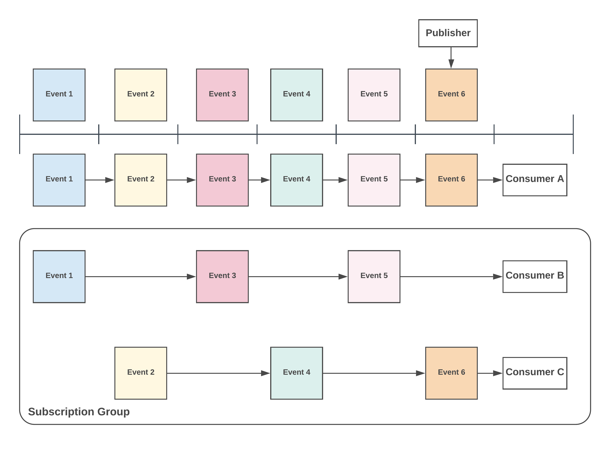

# The Basics

## Channels

KubeMQ Channel \(Topic/Subject/Address/Destination\) is a string-based representation of an endpoint or a target of a message. KubeMQ supports [NATS.IO](https://nats.io/documentation/writing_applications/subjects/) Subject-based Messaging patterns for hierarchies, wildcards, and tokens.

## Senders and Receivers

The core functionality of KubeMQ messaging is sending and receiving messages.

**Senders** \(publishers\) can send one or many messages \(stream\) to one or many destinations \(Channel\). Sending a message does not require the set up of any predefined destination.

**Receiver** \(subscribers/listeners\) can receive messages from one or more senders on the same channel or a wildcards channel. Before a Receiver can receive any messages, a Subscription function is needed to register his interest in receiving messages from a senders designation.

## Format

A channel string can be formed from any UTF-8 characters with the following attributes:

* Case sensitive, FOO and foo are different channel names
* No white spaces allowed
* Cannot be Blank \(`"`\)
* `.`, `*`, `>` are special characters for token hierarchies.
* Cannot start with `.`
* Can begin with `>` or `*` \(for subscription receivers only\)
* Unlimited hierarchies

## Hierarchies

Channels names can be separated by the `.` symbol to create messaging stream hierarchies.

One level hierarchy:

`foo`, `USA`, `org` are valid one level hierarchies.

Two-level hierarchies:

`foo.bar`, `USA.NewYork`, `org.department` are valid two-level hierarchies.

N level hierarchies:

`foo.bar.A.B.C.>` is valid n \(n=6\) level hierarchies.

## Wildcards 

KubeMQ supports two wildcards, `*` and `>`. Wildcards are used to subscribe to a group of channels’strings.

### Asterisk `*` 

Matching a single token in any hierarchy

### Greater `>` 

Matching one or more tokens at the tail of a channel

Examples:

Here some cases of channel subscription patterns and which types of messages with channels are accepted and ignored.

| Channel Pattern | Messages Accepted | Messages Ignored |  |
| :--- | :--- | :--- | :--- |
| `foo` | `foo` | `bar`,`zoo` |  |
| `foo.*` | `foo.bar`,`foo.ZOO` | `foo`,`foo.bar.zoo` |  |
| `foo.>` | `foo.bar.zoo` | `foo` |  |
| `foo.*.*.bar` | `foo.a.b.bar` | `foo.bar.zoo` |  |
| `foo*.>` | `foo.bar`,foo1.bar\` | `foo\` |  |
| `>` | any message | none |  |

## Multicast Destinations

RPC and Queues **senders** can multicast a message to many channels at once, even to a different messaging pattern. Separate each destination with a `;` and specify the message pattern type with `:`.

### Message Pattern Format

| Pattern | Format | Example |
| :--- | :--- | :--- |
| Events | events: | events: events.foo.bar;events: events.foo.bar.1 |
| Events Store | events\_store: | events\_store: store.foo.bar;events\_store: store.foo.bar.1 |
| Queues | queues: | queues: q1.foo.bar; queues: q2.foo.bar |

### Predefined Routes - Smart routes

A predefined routes rule can be set with Kubemq Smart Routing configuration and can be used like that:

| Pattern | Format | Will routes |
| :--- | :--- | :--- |
| Routes | routes: all-foo-bar | to all destinations defined by all-foo-bar route |

More on Smart Routes here:



### Mixing Message Pattern destinations

Mixing message pattern destination is allowed. for example, an events sender can send a message to events\_store subscriber and to a queues subscriber at the same time.

### Examples

| Sends From | Channel Destinations | Will routes to |
| :--- | :--- | :--- |
| Events | foo.bar;foo.bar.1;events\_store: store.foo;queues: q1 | events-&gt;foo.bar, events-&gt;foo.bar.1, events\_store-&gt;store.foo, queues-&gt;q1 |
| Events Store | foo.bar.store;events: bar.1;queues:q2; routes:my-route | events\_store-&gt;foo.bar.store, events-&gt; bar.1, queues -&gt; q2, all destinations defined by my-route |
| Queues | q1.foo.bar;events: bar.1;events\_store:store.foo.1 | queues-&gt; q1.foo.bar, events-&gt; bar.1, events\_store-&gt; store.foo.1 |

## Grouping \(Load Balancing\) 

KubeMQ supports grouping receivers with the same subscription channel patterns to form a load balancing group. The group pattern is a useful pattern for sharing message load handling between services and for redundancy functionality too.

During a Subscription request, the receiver can set the group name to join or not. Based on the Group value setting KubeMQ will deliver messages to the receiver as follows:

* Any receiver without a group setting \(group="", blank\)
* Only one receiver for each group he belongs to

Example:

In the table below we have 8 receivers which subscribe to different channels and groups:

| Receiver Name | Channel | Group |
| :--- | :--- | :--- |
| R1 | `foo.>` | `""` |
| R2 | `foo.>` | `g1` |
| R3 | `foo.>` | `g1` |
| R4 | `foo.*` | `g2` |
| R5 | `foo.*` | `g2` |
| R6 | `>` | `w1` |
| R7 | `*` | `""` |
| R8 | `foo.bar` | `""` |

In the table below, we explore several message channels and which receiver will get them:

| Sending Message to Channel | Receivers |
| :--- | :--- |
| `foo` | R6,R7 |
| `foo.bar` | R1, R2 or R3, R4 or R5, R6, R8 |
| `foo.bar.zoo` | R1, R2 or R3, R6, R8 |

