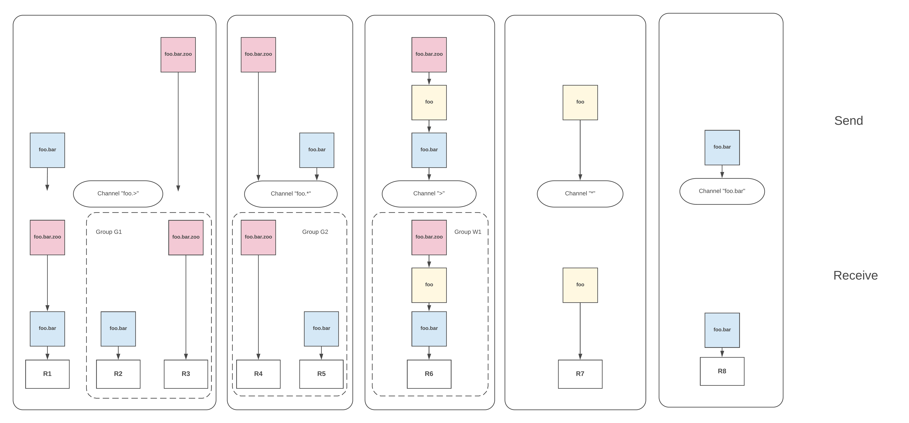

# Channels

KubeMQ Channel \(Topic/Subject/Address/Destination\) is a string-based representation of an endpoint or a target of a message. KubeMQ supports [NATS.IO](https://nats.io/documentation/writing_applications/subjects/) Subject-based Messaging patterns for hierarchies, wildcards, and tokens.

## Senders and Receivers

The core functionality of KubeMQ messaging is sending and receiving messages.

**Senders** \(publishers\) can send one or many messages \(stream\) to one or many destinations \(Channel\). Sending a message does not require the set up of any predefined destination.

**Receiver** \(subscribers/listeners\) can receive messages from one or more senders on the same channel or a wildcards channel. Before a Receiver can receive any messages, a Subscription function is needed to register his interest in receiving messages from a senders designation.

## Format

A channel string can be formed from any UTF-8 characters with the following attributes:

* Case sensitive, FOO and foo are different channel names
* No white spaces allowed
* Cannot be Blank \(`"`\)
* `.`, `*`, `>` are special characters for token hierarchies.
* Cannot start with `.`
* Can begin with `>` or `*` \(for subscription receivers only\)
* Unlimited hierarchies

## Hierarchies

Channels names can be separated by the `.` symbol to create messaging stream hierarchies.

One level hierarchy:

`foo`, `USA`, `org` are valid one level hierarchies.

Two-level hierarchies:

`foo.bar`, `USA.NewYork`, `org.department` are valid two-level hierarchies.

N level hierarchies:

`foo.bar.A.B.C.>` is valid n \(n=6\) level hierarchies.

## Wildcards 

KubeMQ supports two wildcards, `*` and `>`. Wildcards are used to subscribe to a group of channels’strings.

### Asterisk `*` 

Matching a single token in any hierarchy

### Greater `>` 

Matching one or more tokens at the tail of a channel

Examples:

Here some cases of channel subscription patterns and which types of messages with channels are accepted and ignored.

| Channel Pattern | Messages Accepted | Messages Ignored |  |
| :--- | :--- | :--- | :--- |
| `foo` | `foo` | `bar`,`zoo` |  |
| `foo.*` | `foo.bar`,`foo.ZOO` | `foo`,`foo.bar.zoo` |  |
| `foo.>` | `foo.bar.zoo` | `foo` |  |
| `foo.*.*.bar` | `foo.a.b.bar` | `foo.bar.zoo` |  |
| `foo*.>` | `foo.bar`,foo1.bar\` | `foo\` |  |
| `>` | any message | none |  |

