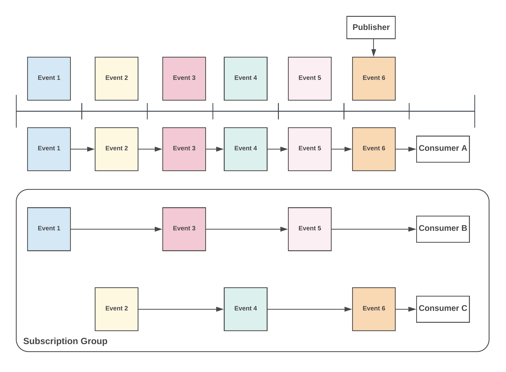

# Grouping

## General

KubeMQ supports grouping receivers with the same subscription channel patterns to form a load balancing group.

## Consumer Groups

The group pattern is a useful pattern for sharing message load handling between services and for redundancy functionality too.

During a Subscription request, the receiver can set the group name to join or not. Based on the Group value setting KubeMQ will deliver messages to the receiver as follows:

* Any receiver without a group setting \(group="", blank\)
* Only one receiver for each group he belongs to

Example:

In the table below we have 8 receivers which subscribe to different channels and groups:

| Receiver Name | Channel | Group |
| :--- | :--- | :--- |
| R1 | `foo.>` | `""` |
| R2 | `foo.>` | `g1` |
| R3 | `foo.>` | `g1` |
| R4 | `foo.*` | `g2` |
| R5 | `foo.*` | `g2` |
| R6 | `>` | `w1` |
| R7 | `*` | `""` |
| R8 | `foo.bar` | `""` |

In the table below, we explore several message channels and which receiver will get them:

| Sending Message to Channel | Receivers |
| :--- | :--- |
| `foo` | R6,R7 |
| `foo.bar` | R1, R2 or R3, R4 or R5, R6, R8 |
| `foo.bar.zoo` | R1, R2 or R3, R6, R8 |

