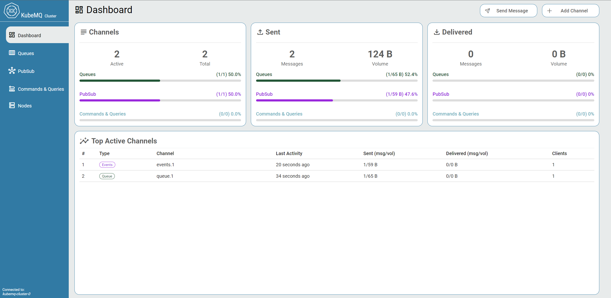
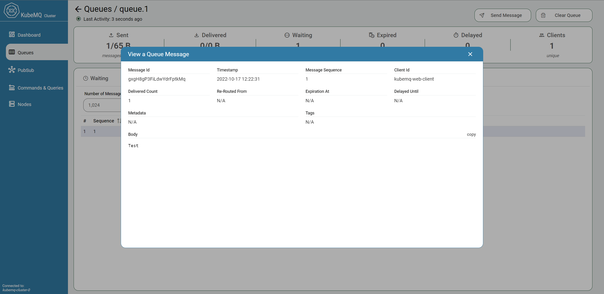
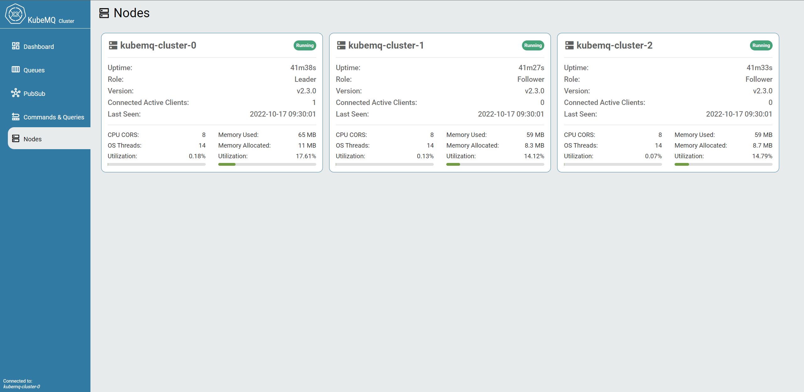

# What's New

## What's new in KubeMQ Release v2.3

### KubeMQ Dashboard

KubeMQ has new web interface for all KubeMQ functions:

<figure><figcaption>
KubeMQ Dashboard
</figcaption></figure>

<figure><figcaption>
View Queue Message
</figcaption></figure>

<figure><figcaption>
KubeMQ Cluster Nodes
</figcaption></figure>

## What's new in KubeMQ Release v2

### KubeMQ Operator

KubeMQ Operator is a software extension to Kubernetes that make use of KubeMQ's [custom resources](https://kubernetes.io/docs/concepts/extend-kubernetes/api-extension/custom-resources/) to manage the lifecycle of KubeMQ applications and associated components.

KubeMQ release v2 introducing two core custom resources:

1. **KubeMQCluster** - manage KubeMQ server Statefulset deployment with associated config map, secrets, and services configuration.
2. **KubeMQDashboard** - manage Prometheus and Grafana based dashboard monitoring for KubeMQ clusters deployment.

KubeMQ Operator is deployed in a predefined namespace and manage the whole lifecycle of KubeMQ components within the namespace.

**KubeMQ Operator is a certified Red Hat Openshift Operator.**

### KubeMQ Server

Release v2 brings new features, enhancements to existing features together with performance improvements, mainly in messaging patterns that need storage such events store and queues. KubeMQ v2 is faster, stable, secured , and easy to manage than ever.

#### New Features

1. **Authentication Access Control** - allows controlling the access of clients to KubeMQ gRPC and Rest interfaces.[ Learn More](learn/access-control/authentication.md).
2. **Authorization Access Control** - allows controlling the access of clients to KubeMQ server resources (Channels, Read, and Write). [Learn More](learn/access-control/authorization.md).
3. **Notifications Access Control** - allows getting an event for any access connection attempt.  [Learn More](learn/access-control/notifications.md).
4. **Smart Routing** - In-flight and routing tables messaging allows to multicast messages to many destinations with a single message. [Learn More](learn/the-basics/smart-routing.md)

#### Enhancements to Existing Features

1. **Inbound Traffic Control** - allows controlling the messaging flow based on the state of cluster health (Circuit Breaker).
2. **Cluster Security** - simple TLS and mTLS configuration with the ability to control buffers and message size.
3. **Persistent Store Configuration** - In addition to simple PVC configuration, a Storage Class setting was added.
4. **StatefulSet Deployment** - Easy configurations to Health, Resources, and Node Selectors were added.

#### Performance Improvements

1. **Write to Store Optimization** - faster writing operation to the underlying file storage increased the sending rate of events store and queue messages dramatically.
2. **Memory and CPU Optimization** - reducing memory allocation and improvements to core algorithms increased the messaging processing throughput while reducing CPU and Memory consumptions

### KubeMQ Dashboard

KubeMQ Dashboard is pre-configured Grafana/Prometheus deployment, which scrape KubeMQ Prometheus endpoints and present all KubeMQ's available metrics such messages counts and volumes, errors, clients information, channels data across al messaging patterns. Learn More.

### Helm Charts

With the release of KubeMQ v2, helm charts repositories ware updated with the up-to-date KubeMQ's custom resources and configuration values.

Helm version 3 is required to install and manage KubeMQ charts.

[Deploy KubeMQ Server with Helm](getting-started/create-cluster/helm.md#install-kubemq-cluster-enterprise-edition)

[Deploy KubeMQ Dashboard with Helm](getting-started/create-dashboard/helm.md#install-kubemq-dashboard)

### Kubemqctl

Kubemqctl is KubeMQ's CLI (Command Line Interface), which allows us to manage and control KubeMQ's applications and components with additional companion development tools that ease the development complexity of Kubernetes application based.

#### Key Features

* Create, Update, and Delete KubeMQ applications and components such as KubeMQ Cluster and Dashboard.
* Show Events Logs and configuration for KubeMQ Cluster
* Set Port-Forward proxy to KubeMQ cluster to ease development cycle
* Set and Manage Kubernetes contexts for quick context switching between Kubernetes environments
* Attach command allows monitoring any channel in any message pattern messages content  in real-time
* Full access to KubeMQ functions:
  * Queues - Send, Receive, List, Attach, Stream, Peek and Ack-All
  * Events - Send, Receive, and Attach
  * Events Store - Send, Receive, List and Attach
  * Commands - Send, Receive, and Attach
  * Queries - Send, Receive, and Attach

[Deploy KubeMQ Server with Kubemqctl](getting-started/create-cluster/kubemqctl.md#install-kubemq-cluster-community-edition)

[Deploy KubeMQ Dashboard with Kubectl](getting-started/create-dashboard/kubemqctl.md#install-kubemq-dashboard)
